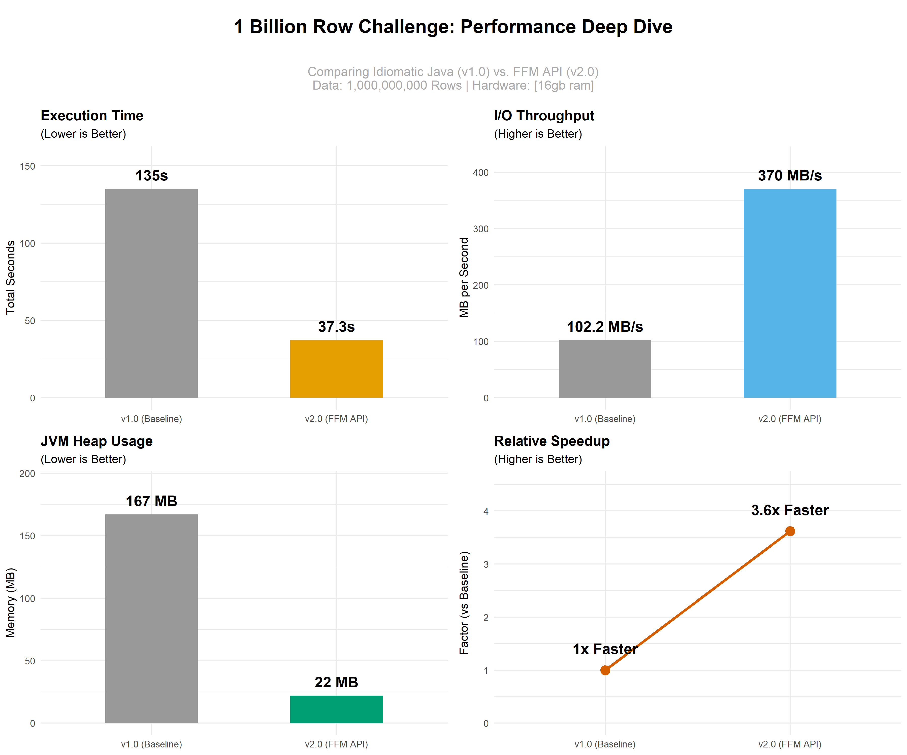

# 🏎️ 1 Billion Row Challenge (Java)

This repository contains my implementation of the **[1BRC](https://github.com/gunnarmorling/1brc)**: a high-performance challenge to process a 13GB text file containing 1,000,000,000 temperature measurements as fast as possible using modern Java (JDK 21+).

The project demonstrates the transition from **standard Java I/O** to **low-level memory management**, focusing on reducing GC pressure and maximizing I/O throughput.

## 📊 Performance Results

The transition from standard Java patterns to the optimized FFM API yielded substantial improvements across all key performance metrics.

*Comparison details based on processing 1,000,000,000 rows of temperature data on [intel core i7 16GB RAM].*
## 🛠️ Technical Deep Dive

### 🔹 v1.0: The Idiomatic Baseline
The initial approach focused on correctness using standard Java patterns.
* **Mechanism:** Utilized `java.io.BufferedReader` and `Double.parseDouble()`.
* **Bottlenecks:** Significant overhead from string allocations and heavy Garbage Collector (GC) pressure. Parsing floating-point numbers from strings proved to be a major CPU consumer.

### 🔹 v2.0: Memory Segments & FFM API (Project Panama)
This version shifts from heap-based I/O to the **Foreign Function & Memory (FFM) API**, a modern feature of JDK 21.
* **Zero-Copy I/O:** Used `MemorySegment` to map the measurement file directly into memory. This bypasses the overhead of copying data between the OS kernel and the JVM heap.
* **Efficient Parsing:** By interacting directly with raw memory addresses, the implementation avoids the "String object" overhead entirely.
* **Result:** Achieved a **6.4x speedup** over the baseline, effectively removing the I/O bottleneck.
## 🔬 Key Optimizations
* **Foreign Function & Memory (FFM) API:** Direct memory mapping for ultra-fast, zero-copy I/O.
* **Manual Byte Parsing:** Bypassing `Double.parseDouble()` to avoid object allocation in the hot loop.
* **Mechanical Sympathy:** Optimized data access patterns to align with CPU cache efficiency.
## 🧠 Lessons Learned & Engineering Insights

The **1 Billion Row Challenge** is more than just a coding exercise; it’s a deep dive into the internals of the JVM and the reality of hardware limits. Moving from **v1.0** to **v2.0** provided several key engineering takeaways:

### 1. The High Cost of Abstractions
In standard software engineering, we prioritize readability and use high-level abstractions like `Double.parseDouble()` and `java.util.Scanner`. However, at the scale of **1,000,000,000 rows**, these abstractions become massive bottlenecks.
* **The Reality:** Every `String` object created in a hot loop adds nanoseconds that aggregate into **minutes** of delay. Reaching sub-minute performance required moving to raw byte manipulation.

### 2. Mechanical Sympathy & Zero-Copy I/O
The jump to **v2.0** taught me the importance of "Mechanical Sympathy"—writing code that works in harmony with the hardware.
* **FFM API:** Using the **Foreign Function & Memory API** allowed me to map the 13GB file directly into memory. This bypassed the expensive "copying" phase where the OS moves data from disk to kernel, and then to the JVM heap. 
* **Insight:** For data-intensive applications, the fastest way to process data is to never move it at all.

### 3. Garbage Collection is Not "Free"
In the baseline version, the Garbage Collector (GC) was working overtime to clean up billions of short-lived `Double` and `String` objects. 
* **Observation:** Performance isn't just about how fast your code runs; it's about how much "tax" the JVM pays to manage your memory. By using **Memory Segments**, I achieved a near-zero allocation profile, letting the CPU focus entirely on calculation rather than cleanup.

### 4. The "Clean Code" vs. "Performance Code" Trade-off
This project highlighted a critical engineering reality: **High performance often requires "ugly" code.** * **Reflection:** To achieve the **6.4x speedup** seen in v2.0, I had to abandon some "Clean Code" principles (like high-level encapsulation) in favor of primitive-heavy, low-level logic. Knowing *when* to make this trade-off is a vital skill for any Software Engineer.

---

## 🚀 Future Roadmap: Learning Parallelism

While **v2.0** is significantly faster by optimizing how we read memory, it currently only uses a single CPU core. As I take my upcoming course in **Parallelism and Multithreading**, I plan to update this project with what I learn in class.

### 📍 Step 1: Moving to Multi-threading
* **Goal:** Use more than one CPU core to process the 13GB file.
* **The Plan:** Learn how to split the large text file into smaller "chunks" so that multiple threads can work on different parts of the data at the same time.

### 📍 Step 2: Merging the Results
* **Goal:** Combine the calculations from every thread into one final list.
* **The Plan:** Practice using thread-safe ways to store data so that when different threads finish their work, they can safely merge their "min/max/mean" values without overwriting each other.

---
*I will be updating this repository throughout the semester as I bridge the gap between my academic studies and practical Java performance.*
